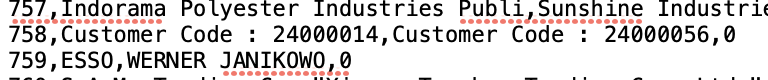

All data in the link:
 https://drive.google.com/drive/folders/1jgBJvnyaFJrMETpaaEqpSWwnVG44cgMn?usp=sharing

## Data description
All parqet files have suffixes depending on pretrained embedding model used.
Here are suffixes definition:
1 - distiluse-base-multilingual-cased-v2
2 - all-MiniLM-L6-v2
3 - all-MiniLM-L12-v2
4 - paraphrase-MiniLM-L6-v2
5 - paraphrase-MiniLM-L12-v2
6 - all-mpnet-base-v2
7 - LaBSE
8 - paraphrase-multilingual-MiniLM-L12-v2

## Original data:  
train.csv

## Dataset number 1  
File name:  train.parquet
 Only english samples

Three columns:  
name_1, name_2, bool_match

Format parquet, compression="brotli"

Libs: pandas, csv, langdetect, spacy, numpy, etc
Quotes removed in the names, commas left

## Dataset number 2 
File name:  all_lang_train.parquet
 All samples

Three columns:  
name_1, name_2, bool_match

Format parquet, compression="brotli"

Libs: pandas, csv, langdetect, spacy, numpy, etc
Quotes removed in the names, commas left

## Dataset number 3
File name:  languages.parquet
 Append company names from column 'name_2' to column 'name_1' and detecting the language of each name

Two columns:  
names, languages_langdetect

Format parquet, compression="brotli"

Libs: pandas, csv, langdetect, spacy, numpy, etc
Quotes removed in the names, commas left

# Сleaning and parsing data
File name: Clear_data.ipynb

This file:
<li>remove column 'pair_id'</li>
<li>remove all errors like the picture below</li>
<li>append names of company to new file and detect language</li>
<li>create file with only english samples</li>
<li>remove quotes</li>

